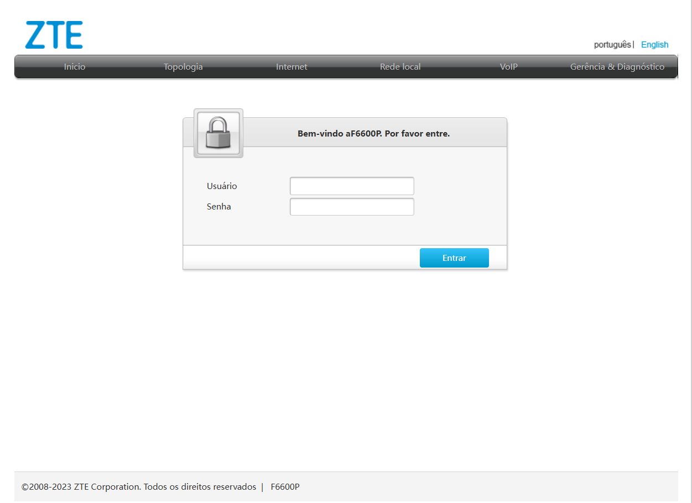
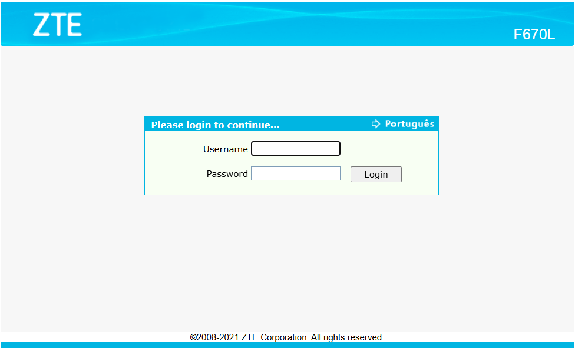

🛠️ automacao_back_ups

Automação projetada para economizar tempo restaurando backups de configurações de equipamentos de rede.

Este projeto contém um script em Python que detecta dispositivos na rede e usa Playwright para acessar a interface web dos equipamentos e restaurar suas configurações a partir de arquivos de backup.

📋 Descrição

O script (equip.py) automatiza o processo de restauração de backups de configuração em equipamentos de rede (ex.: roteadores).
O usuário escolhe o modelo do equipamento e o script:

tenta encontrar um IP disponível na rede;

abre a interface web do equipamento;

faz login;

sobe o arquivo de backup correspondente ao dispositivo;

aciona a restauração via interface.

Suporta modelos como:

✔️ AX3000+

✔️ V9

✔️ F670

Os backups de configuração são carregados a partir de arquivos .bin presentes no repositório.

🚀 Funcionalidades

Detecta o primeiro IP disponível entre opções definidas.

Abre interface web do equipamento com Playwright para realizar a restauração.

Automatiza login e navegação na interface para cada modelo.

Utiliza arquivos de backup específicos conforme modelo selecionado.

⚙️ Tecnologias

Este projeto usa:

🐍 Python 3.x

🔧 Playwright para automação de navegador

📦 requests para verificação de disponibilidade de IP

📁 Scripts e backups de configuração (.bin) para cada modelo de equipamento

📁 Estrutura do Repositório
automacao_back_ups/
├── F6600P.bin
├── F670L V1.bin
├── F670L V9.bin
├── equip.py
└── README.md

Arquivos .bin são os backups das configurações que serão restaurados via interface web.

🧠 Como Funciona (Resumo)

O script pergunta ao usuário qual modelo de equipamento será restaurado.

Testa uma lista de possíveis IPs para encontrar um que esteja disponível.

Se encontra, abre usando Playwright e realiza as ações na interface para restaurar o backup.

📥 Pré-requisitos

Antes de usar o script, instale:

pip install playwright requests
playwright install

🏁 Como Usar

Execute o script:

python equip.py

Responda ao prompt:

Qual Modelo Do equipamento ?: (AX3000 - V9 - F670):

Digite o modelo desejado e o script cuidará do resto.

❗ Observações Importantes

Certifique-se de que os IPs definidos na lista IPS estejam corretos e acessíveis.

As credenciais usadas no script (multipro) devem corresponder às dos dispositivos.

Playwright abrirá uma janela de navegador real por padrão (modo headless=False).

Teste em um ambiente seguro antes de rodar em produção.

🧩 Contribuição

Contribuições são bem-vindas!
Se quiser adicionar suporte a mais equipamentos, melhorar a lógica de detecção de IP ou parametrizar credenciais, abra um issue ou pull request.

📄 Licença

Este projeto ainda não especifica uma licença no repositório.
Recomenda-se adicionar um arquivo LICENSE apropriado para uso aberto e reutilização.
